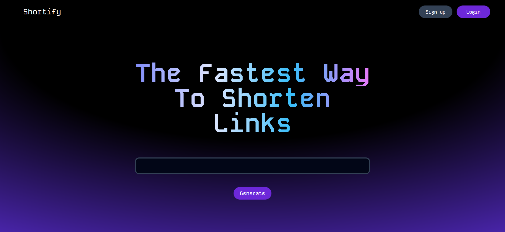

<!-- PROJECT LOGO -->
<br />
<div align="center">
  <a href="https://github.com/mendacium-a11y/">
    
  </a>

  <h3 align="center">Shortify</h3>

  <p align="center">
Shortify is a convenient tool that allows you to shorten your links and create QRcodes

<br />
<a href="https://github.com/mendacium-a11y/">View Demo</a>
·
<a href="https://github.com/mendacium-a11y/Shortify/issues">Report Bug</a>
·
<a href="https://github.com/mendacium-a11y/Shortify/issues">Request Feature</a>
</p>
</div>

<!-- ABOUT THE PROJECT -->
## About The Project



Shortify is a web application that simplifies link management by offering two key functionalities:
- URL Shortening: Paste any lengthy URL into Shortify, and it will be transformed into a concise, user-friendly version. This not only improves readability but also makes sharing links through various platforms more convenient.
- QR Code Generation: Each shortened URL automatically generates a corresponding QR code. This allows users to share links seamlessly through printed materials, presentations, or even physical objects. Simply scan the QR code with a mobile device camera, and you'll be instantly directed to the original link.

<p align="right">(<a href="#readme-top">back to top</a>)</p>


### Built With

This section should list any major frameworks/libraries used to bootstrap your project. Leave any add-ons/plugins for the acknowledgements section. Here are a few examples.

* [![React][React.js]][React-url]


<p align="right">(<a href="#readme-top">back to top</a>)</p>


<!-- GETTING STARTED -->
## Getting Started
### Prerequisites

- npm
- NodeJS
- SQLite3

### Installation

1. Clone the repo
   ```sh
   git clone https://github.com/your_username_/Project-Name.git
   ```
2. Install NPM packages
   ```sh
   npm install
   ```

<p align="right">(<a href="#readme-top">back to top</a>)</p>


<!-- USAGE EXAMPLES -->
## Usage

Use this space to show useful examples of how a project can be used. Additional screenshots, code examples and demos work well in this space. You may also link to more resources.

_For more examples, please refer to the [Documentation](https://example.com)_

<p align="right">(<a href="#readme-top">back to top</a>)</p>


<!-- CONTRIBUTING -->
## Contributing

Contributions are what make the open source community such an amazing place to learn, inspire, and create. Any contributions you make are **greatly appreciated**.

If you have a suggestion that would make this better, please fork the repo and create a pull request. You can also simply open an issue with the tag "enhancement".
Don't forget to give the project a star! Thanks again!

1. Fork the Project
2. Create your Feature Branch (`git checkout -b feature/AmazingFeature`)
3. Commit your Changes (`git commit -m 'Add some AmazingFeature'`)
4. Push to the Branch (`git push origin feature/AmazingFeature`)
5. Open a Pull Request

<p align="right">(<a href="#readme-top">back to top</a>)</p>


<!-- LICENSE -->
## License

Distributed under the MIT License. See `LICENSE` for more information.

<p align="right">(<a href="#readme-top">back to top</a>)</p>


<!-- CONTACT -->
## Contact

Your Name - [@your_twitter](https://twitter.com/your_username) - email@example.com

Project Link: [https://github.com/your_username/repo_name](https://github.com/your_username/repo_name)

<p align="right">(<a href="#readme-top">back to top</a>)</p>


